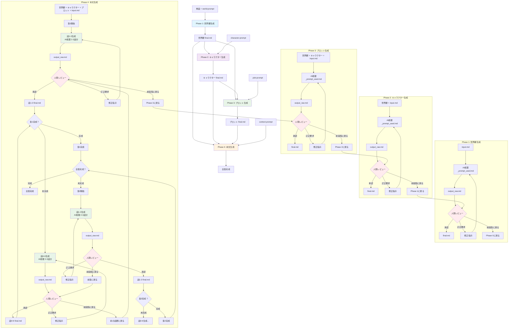

# Narou-Maker2 ストーリー創作システム

## 1. システム概要

### 4段階ストーリー生成プロセス



### 各段階の処理内容

| 段階 | 入力 | 処理方法 | 出力 |
|------|------|----------|------|
| Phase 1 | 単語 + world-prompt | Layered World Building Method | 世界観 final.md |
| Phase 2 | 世界観 + character-prompt | Omnibus Adaptability | キャラクター final.md |
| Phase 3 | 世界観 + キャラクター + plot-prompt | Instant Entertainment Logic Model | プロット final.md |
| Phase 4 | 世界観 + キャラクター + プロット + context-prompt | Cinematic Description System | 本文 final.md |

### 人間レビューの選択肢

各段階のレビューで選択できる行動：

- ✅ **承認**: 次段階/話群に進む
- 🔄 **修正要求**: 同じ段階/話群で修正指示を追加して再生成
- ↩️ **前段階/話群に戻る**: 前の段階のレビューに戻って修正
- 🔙 **Phase 3に戻る**: （Context執筆時のみ）プロット自体を修正

---

## 2. 実行チェックリスト

### 事前準備チェックリスト

- [ ] プロジェクトフォルダ作成済み（例：`Project_XXX_YYYYMMDD_HHMMSS`）
- [ ] 必要なディレクトリ構造作成済み
- [ ] _templatesからプロンプトファイルをコピー済み

### Phase 1: 世界観生成チェックリスト

- [ ] `01_World/input.md` 作成（世界観の核となる3つのキーワード記載）
- [ ] `01_World/_prompt_used.md` 準備完了
- [ ] AI処理実行
- [ ] `01_World/output_raw.md` 保存完了
- [ ] 人間レビュー実施
- [ ] **承認の場合**: `01_World/final.md` 作成、Phase 2へ
- [ ] **修正要求の場合**: 修正指示追加、AI処理再実行
- [ ] **前段階に戻る場合**: キーワード見直し

### Phase 2: キャラクター生成チェックリスト

- [ ] `02_Character/input.md` 作成（キャラクターのキーワード記載）
- [ ] `02_Character/_prompt_used.md` 準備完了
- [ ] `01_World/final.md` 内容確認済み
- [ ] AI処理実行（世界観 + キャラクター入力）
- [ ] `02_Character/output_raw.md` 保存完了
- [ ] 人間レビュー実施
- [ ] **承認の場合**: `02_Character/final.md` 作成、Phase 3へ
- [ ] **修正要求の場合**: 修正指示追加、AI処理再実行
- [ ] **Phase 1に戻る場合**: 世界観修正実施

### Phase 3: プロット生成チェックリスト

- [ ] `03_Plot/input.md` 作成（プロットのキーワード記載）
- [ ] `03_Plot/_prompt_used.md` 準備完了
- [ ] `01_World/final.md` 内容確認済み
- [ ] `02_Character/final.md` 内容確認済み
- [ ] AI処理実行（世界観 + キャラクター + プロット入力）
- [ ] `03_Plot/output_raw.md` 保存完了
- [ ] 人間レビュー実施
- [ ] **承認の場合**: `03_Plot/final.md` 作成、Phase 4へ
- [ ] **修正要求の場合**: 修正指示追加、AI処理再実行
- [ ] **Phase 2に戻る場合**: キャラクター修正実施

### Phase 4: 本文生成チェックリスト

#### 4.1 章単位計画

- [ ] `04_Context/input.md` 作成（章全体の概要記載）
- [ ] プロットに基づく章構成決定
- [ ] 各章の話群分割計画作成

#### 4.2 話群単位実行（各話群で繰り返し）

**話群準備**
- [ ] `Chapter_XX/Episodes_YY-ZZ/input.md` 作成
- [ ] `Chapter_XX/Episodes_YY-ZZ/_prompt_used.md` 準備完了
- [ ] 前の話群の `final.md` 内容確認済み（2話群目以降）

**AI処理実行**
- [ ] `01_World/final.md` 内容確認済み
- [ ] `02_Character/final.md` 内容確認済み
- [ ] `03_Plot/final.md` 内容確認済み
- [ ] AI処理実行（全素材 + 話群入力）
- [ ] `Chapter_XX/Episodes_YY-ZZ/output_raw.md` 保存完了

**話群レビュー**
- [ ] 人間レビュー実施
- [ ] **承認の場合**: `Chapter_XX/Episodes_YY-ZZ/final.md` 作成、次話群へ
- [ ] **修正要求の場合**: 修正指示追加、AI処理再実行
- [ ] **前の話群に戻る場合**: 前話群のレビューに戻る
- [ ] **Phase 3に戻る場合**: プロット修正実施

#### 4.3 章完成確認

- [ ] 全話群の `final.md` 確認完了
- [ ] `Chapter_XX/chapter_final.md` 作成
- [ ] 章全体の一貫性確認
- [ ] 必要に応じて個別話群修正

#### 4.4 全章統合

- [ ] 全章の `chapter_final.md` 確認完了
- [ ] `04_Context/context_final.md` 作成
- [ ] 作品全体の完成度確認

---

## 3. プロジェクト構造

### 必要なディレクトリ構造

```
Project_XXX/
├── 01_World/
│   ├── input.md
│   ├── _prompt_used.md
│   ├── output_raw.md
│   └── final.md
├── 02_Character/
│   ├── input.md
│   ├── _prompt_used.md
│   ├── output_raw.md
│   └── final.md
├── 03_Plot/
│   ├── input.md
│   ├── _prompt_used.md
│   ├── output_raw.md
│   └── final.md
├── 04_Context/
│   ├── input.md
│   ├── _prompt_used.md
│   ├── Chapter_01/
│   │   ├── Episodes_01-03/
│   │   │   ├── input.md
│   │   │   ├── _prompt_used.md
│   │   │   ├── output_raw.md
│   │   │   └── final.md
│   │   ├── Episodes_04-06/
│   │   │   └── [同じ構造]
│   │   └── chapter_final.md
│   ├── Chapter_02/
│   │   └── [同じ構造]
│   ├── drafts/
│   └── context_final.md
└── _work/
```

### ファイル役割

| ファイル名 | 役割 | 作成者 | 内容 |
|-----------|------|--------|------|
| `input.md` | 入力指定 | 人間 | 各段階の具体的な要求・キーワード |
| `_prompt_used.md` | プロンプト | 人間 | _templatesからコピーしたプロンプト |
| `output_raw.md` | 生成結果 | AI | AIによる生成結果（未編集） |
| `final.md` | 最終版 | 人間 | レビュー・修正後の最終版 |

---

## 4. 実行手順詳細

### 4.1 プロジェクト開始手順

1. **プロジェクトフォルダ作成**
   ```bash
   mkdir projects/Project_XXX_YYYYMMDD_HHMMSS
   cd projects/Project_XXX_YYYYMMDD_HHMMSS
   ```

2. **ディレクトリ構造作成**
   ```bash
   mkdir -p 01_World 02_Character 03_Plot 04_Context/drafts _work
   ```

3. **プロンプトファイルコピー**
   ```bash
   cp ../../_templates/prompt_world.md 01_World/_prompt_used.md
   cp ../../_templates/prompt_char.md 02_Character/_prompt_used.md
   cp ../../_templates/prompt_plot.md 03_Plot/_prompt_used.md
   cp ../../_templates/prompt_context.md 04_Context/_prompt_used.md
   ```

### 4.2 各段階実行手順

#### Phase 1 実行手順

1. **input.md作成**
   - `01_World/input.md` を作成
   - 世界観の核となる3つのキーワードを記載

2. **AI処理実行**
   - `01_World/_prompt_used.md` の内容を確認
   - `01_World/input.md` の内容を組み込んでAIに実行指示
   - 結果を `01_World/output_raw.md` に保存

3. **人間レビュー**
   - `01_World/output_raw.md` を確認
   - 以下から判断:
     - 承認 → `01_World/final.md` 作成、Phase 2へ
     - 修正要求 → 修正指示追加、Step 2に戻る
     - 前段階に戻る → キーワード見直し、Step 1に戻る

#### Phase 2 実行手順

1. **input.md作成**
   - `02_Character/input.md` を作成
   - キャラクターのキーワードを記載

2. **AI処理実行**
   - `02_Character/_prompt_used.md` の内容を確認
   - `01_World/final.md` の内容を確認
   - 両方を組み込んでAIに実行指示
   - 結果を `02_Character/output_raw.md` に保存

3. **人間レビュー**
   - `02_Character/output_raw.md` を確認
   - 以下から判断:
     - 承認 → `02_Character/final.md` 作成、Phase 3へ
     - 修正要求 → 修正指示追加、Step 2に戻る
     - Phase 1に戻る → 世界観修正、Phase 1のStep 3に戻る

#### Phase 3 実行手順

1. **input.md作成**
   - `03_Plot/input.md` を作成
   - プロットのキーワードを記載

2. **AI処理実行**
   - `03_Plot/_prompt_used.md` の内容を確認
   - `01_World/final.md` の内容を確認
   - `02_Character/final.md` の内容を確認
   - 全てを組み込んでAIに実行指示
   - 結果を `03_Plot/output_raw.md` に保存

3. **人間レビュー**
   - `03_Plot/output_raw.md` を確認
   - 以下から判断:
     - 承認 → `03_Plot/final.md` 作成、Phase 4へ
     - 修正要求 → 修正指示追加、Step 2に戻る
     - Phase 2に戻る → キャラクター修正、Phase 2のStep 3に戻る

#### Phase 4 実行手順

1. **章単位計画**
   - `04_Context/input.md` を作成（章全体の概要）
   - プロットに基づく章構成決定
   - 各章の話群分割計画作成

2. **話群単位実行**（各話群で繰り返し）
   
   **2.1 話群準備**
   ```bash
   mkdir -p 04_Context/Chapter_01/Episodes_01-03
   ```
   - `Chapter_01/Episodes_01-03/input.md` を作成
   - `Chapter_01/Episodes_01-03/_prompt_used.md` を準備

   **2.2 AI処理実行**
   - `01_World/final.md` の内容を確認
   - `02_Character/final.md` の内容を確認
   - `03_Plot/final.md` の内容を確認
   - 前の話群の `final.md` を確認（2話群目以降）
   - 全てを組み込んでAIに実行指示
   - 結果を `Chapter_01/Episodes_01-03/output_raw.md` に保存

   **2.3 話群レビュー**
   - `Chapter_01/Episodes_01-03/output_raw.md` を確認
   - 以下から判断:
     - 承認 → `Chapter_01/Episodes_01-03/final.md` 作成、次話群へ
     - 修正要求 → 修正指示追加、Step 2.2に戻る
     - 前の話群に戻る → 前話群のレビューに戻る
     - Phase 3に戻る → プロット修正、Phase 3のStep 3に戻る

3. **章完成確認**
   - 全話群の `final.md` を確認
   - `Chapter_01/chapter_final.md` を作成
   - 章全体の一貫性を確認
   - 必要に応じて個別話群修正

4. **全章統合**
   - 全章の `chapter_final.md` を確認
   - `04_Context/context_final.md` を作成
   - 作品全体の完成度を確認

---

## 5. トラブルシューティング

### よくある問題と解決法

1. **AIの生成結果が期待と異なる場合**
   - 修正指示を具体的に記載
   - input.mdの内容を見直し
   - 必要に応じて前段階のfinal.mdを修正

2. **話群の一貫性が保てない場合**
   - 前の話群のfinal.mdを再確認
   - 必要に応じて前の話群のレビューに戻る
   - chapter_final.mdで全体調整

3. **プロジェクト構造が複雑になった場合**
   - drafts/フォルダで試行錯誤
   - _work/フォルダで作業ファイル管理
   - 必要に応じて構造を簡素化

### 品質確保のポイント

- 各段階で必ずfinal.mdを作成する
- レビュー時の判断基準を明確にする
- 前段階の成果物を確実に次段階に引き継ぐ
- 話群単位で品質を確保してから次に進む