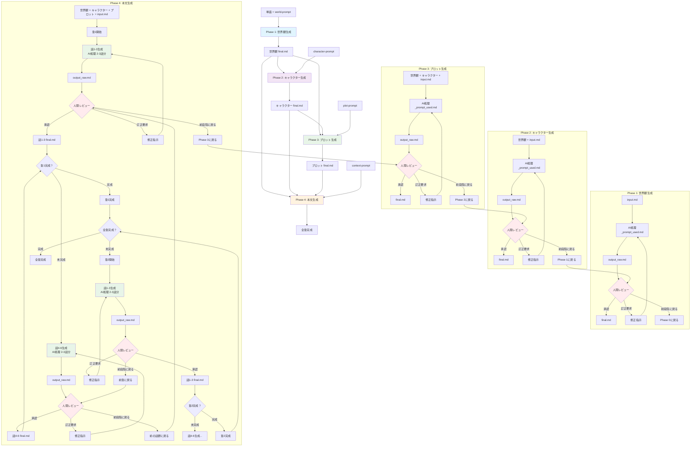

# Narou-Maker2 ワークフロー図

## 4段階ストーリー生成プロセス

## ワークフロー概要

### Phase 1: 世界観生成
- **入力**: 単語 + world-prompt
- **処理**: Layered World Building Method による世界設定構築
- **出力**: 世界観 final.md

### Phase 2: キャラクター生成
- **入力**: 世界観 + character-prompt  
- **処理**: Omnibus Adaptability アプローチによるキャラクター作成
- **出力**: キャラクター final.md（主人公中心）

### Phase 3: プロット生成
- **入力**: 世界観 + キャラクター + plot-prompt
- **処理**: Instant Entertainment Logic Model によるストーリー構造構築
- **出力**: プロット final.md

### Phase 4: 本文生成
- **入力**: 世界観 + キャラクター + プロット + context-prompt
- **処理**: Cinematic Description System による実際の物語執筆
- **出力**: 章・話単位での本文 final.md

## 品質管理システム

### 人間レビュープロセス
各段階で以下の選択肢が提供されます：
- ✅ **承認**: 次段階に進む
- 🔄 **訂正要求**: 同じ段階内で修正
- ↩️ **前段階に戻る**: 前の段階のレビューに戻る

### AI文字制限対応
Phase 4では以下のような分割処理を行います：
- **章単位**: 大きな区切りでの管理
- **話単位**: 2-3話ずつの実際の生成
- **段階的生成**: AIの処理能力に合わせた分割処理

## ファイル構造

各段階で以下のファイルが生成されます：
- `input.md`: 人間による入力・要求
- `_prompt_used.md`: 使用されたプロンプトテンプレート
- `output_raw.md`: AIによる生成結果
- `final.md`: 人間レビュー後の最終版

## 技術的特徴

- **反復改善**: 各段階での品質向上サイクル
- **柔軟な出戻り**: 前段階への遡及修正
- **段階的構築**: 基盤から応用への順次構築
- **制約対応**: AI処理能力制限への対応